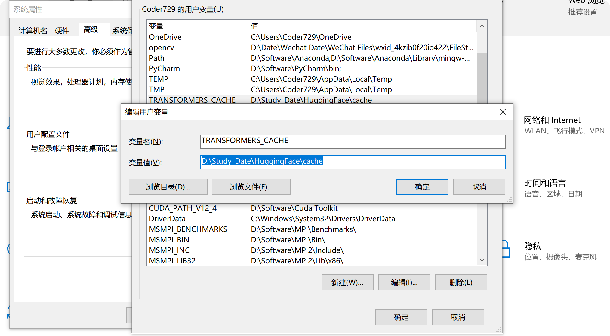
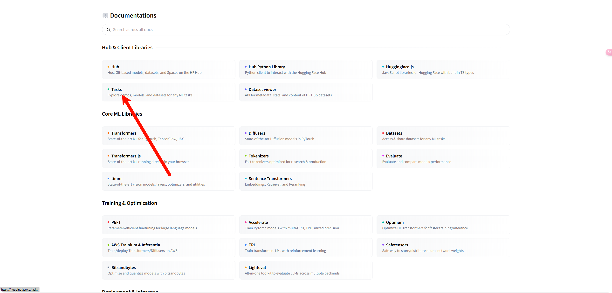
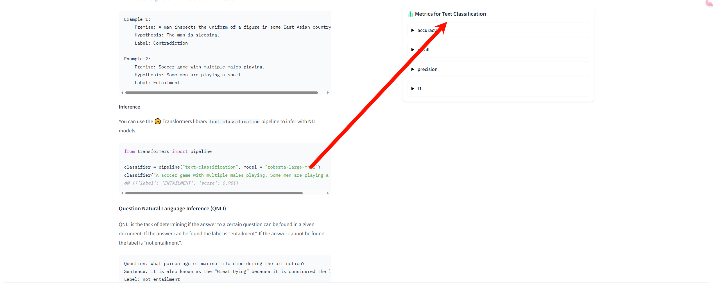

# Transformers 库的学习笔记

Transformers库的学习笔记。

原视频地址：[Transformers](https://space.bilibili.com/21060026)

原作者：https://github.com/zyds

这个仓库包含了与 Hugging Face Transformers 库相关的学习笔记、代码片段、教程和示例，在原作者的基础上进行了部分修改，更加细致，更适合初学者。

## 代码结构

```text
root
│  01_基础知识篇
└─ │  01
   │  02_Pipline
   │  ...
   └─ xx 
      │  xx.py
      │  xx.md # 由ChatGPT生成的代码解释，Prompt：https://bailian.console.aliyun.com/#/prompt-manage
│  02_实战演练篇
│  03_高效微调篇
│  README.md
│  Image
│  ...
│  xx
```

## 目录

| 组件名称  | 笔记                                                   | 官方文档                                                     | 编辑时间  |
| --------- | ------------------------------------------------------ | ------------------------------------------------------------ | --------- |
| Pipeline  | [02_Pipelline](01_基础知识篇/02_Pipeline/pipeline.md)  | [Pipeline](https://huggingface.co/docs/transformers/main/en/quicktour#pipeline) | 2025/2/26 |
| Tokenizer | [03_Tokenizer](01_基础知识篇/03_Tokenizer/tokenizer.md)              | [Tokenizer](https://huggingface.co/docs/transformers/main/en/quicktour#autotokenizer) | 2025/2/26 |
| Model     | [04_Model](01_基础知识篇/04_Model/model.md)&[实战](01_基础知识篇/04_Model/实战.md) | [AutoModel](https://huggingface.co/docs/transformers/main/en/quicktour#automodel) | 2025/2/27 |
| Datasets  | [05_Datasets](01_基础知识篇/05_Datasets.md)                          |                                                              |           |
| Evaluate  | [06_Evaluate](01_基础知识篇/06_Evaluate.md)                          |                                                              | 2025/2/27 |

## 修改Transformers库的默认下载地址

由于 `huggingface_hub` 使用了符号链接（symlinks）来优化缓存存储，这可能导致磁盘空间的消耗。如果不进行修改，默认情况下文件会被缓存到 `C:\Users\Users\.cache\huggingface` 目录中。



## HuggingFace可以查看不同分类任务的评价指标[06_Evaluate](06_Evaluate.md)





