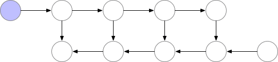

# 梯度检查点（Gradient Checkpointing）

如今大模型的参数量巨大，即使将batch_size设置为1并使用梯度累积的方式更新，也仍然会OOM。原因是通常在计算梯度时，我们需要将所有前向传播时的激活值保存下来，这消耗大量显存。还有另外一种延迟计算的思路，丢掉前向传播时的激活值，在计算梯度时需要哪部分的激活值就重新计算哪部分的激活值，这样做倒是解决了显存不足的问题，但加大了计算量同时也拖慢了训练。

**梯度检查点（Gradient Checkpointing）**在上述两种方式之间取了一个平衡，这种方法采用了一种策略选择了计算图上的一部分激活值保存下来，其余部分丢弃，这样被丢弃的那一部分激活值需要在计算梯度时重新计算。

下面这个动图展示了一种简单策略：前向传播过程中计算节点的激活值并保存，计算下一个节点完成后丢弃中间节点的激活值，反向传播时如果有保存下来的梯度就直接使用，如果没有就使用保存下来的前一个节点的梯度重新计算当前节点的梯度再使用。




Transformer框架开启梯度检查点非常简单，仅需在TrainingArguments中指定gradient checkpoint为True即可：

```python
training_args_3 = TrainingArguments(
    gradient_checkpointing=True, 
    # 开启梯度检查点，官方文档https://huggingface.co/docs/transformers/perf_train_gpu_one#gradient-checkpointing
)
```

## 参考文献

[Methods and tools for efficient training on a single GPU](https://huggingface.co/docs/transformers/perf_train_gpu_one#gradient-checkpointing)

[Gradient Checkpointing](https://blog.csdn.net/Solo95/article/details/131606918)
